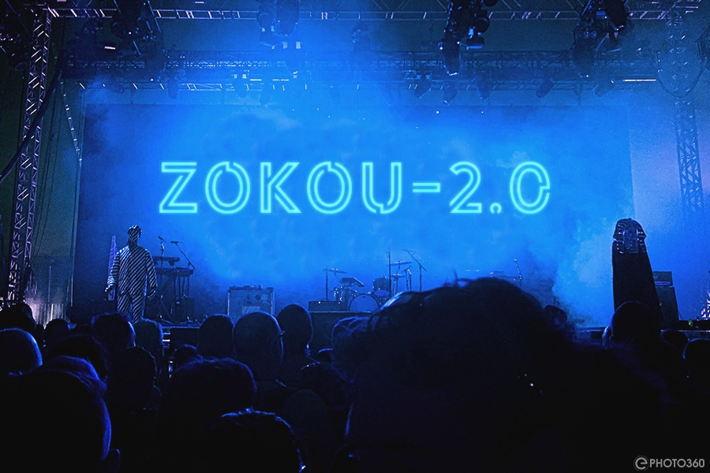

<h1>Zokou-2.0 </h1>  

 Zokou est un bot multi-devices conçu pour enrichir vos conversations WhatsApp avec des fonctionnalités utiles et amusantes. Qu'il s'agisse de gérer des fichiers, d'interagir avec des stickers ou de faciliter la gestion de groupe, Zokou est là pour vous aider.

## Fonctionnalités Principales

- **Téléchargement de Fichiers :** Zokou peut télécharger des fichiers audio et vidéo à partir de liens que vous lui envoyez, pour que vous puissiez les partager facilement avec vos contacts.

- **Exportation de Stickers :** Vous pouvez exporter des stickers de Telegram et les utiliser dans vos conversations WhatsApp en les envoyant simplement à Zokou.

- **Gestion de Groupe :** Zokou offre des fonctionnalités de gestion de groupe, comme l'ajout ou la suppression de membres, la configuration de règles et d'autres paramètres.

- **Text to img :** Les meilleurs logos on été sélectionné pour votre confort.

## Fonctionnalités Ludiques

- **Blagues et Devinettes :** Zokou est équipé d'une collection de blagues et de devinettes pour égayer vos conversations.

- **Citations Inspirantes :** Recevez des citations inspirantes pour vous motiver au quotidien.

## Obtenir Zokou

1. Veillez cliquer sur **[Fork](https://github.com/Luffy2ndAccount/zokou-2.0-versionVF/fork)** afin de copier le repo sur votre compte github.  veillez bien ajouter une etoile 🌟 pour encourager les développeurs 

2. Obtenez une session du bot :  
  
[Session-1](https://zkscan.onrender.com)   
[Session-2](https://zokouscan.onrender.com)  
  

## Déploiement
- **déploiement sur heroku**
  1. si vous ne disposez pas de compte **heroku** cliquez [**ici**](https://id.heroku.com/login) pour vous en procurer un .
  2.  cliquez [**ici**](https://dashboard.heroku.com/new?template=https://github.com/Luffy2ndAccount/zokou-2.0-versionVF) pour deployer le bot sur **heroku**

- **Déploiement sur Koyeb**
  1. si vous n'avez pas de compte **koyeb** cliquez [**ici**](https://dashboard.koyeb.com/signup) pour vous en procurer un .
  2.  cliquez cliquez sur le button pour deployer sur koyeb.  
    
     [](https://app.koyeb.com/deploy?name=zokouvf&type=docker&image=docker.io%2Fluffy077%2Fzokouvf%3Alatest&env%5BPREFIXE%5D=.&env%5BLECTURE_AUTO_STATUS%5D=oui&env%5BTELECHARGER_AUTO_STATUS%5D=oui&env%5BNOM_BOT%5D=Zokou-MD&env%5BLIENS_MENU%5D=https%3A%2F%2Fwallpapercave.com%2Fuwp%2Fuwp3943464.jpeg&env%5BPM_PERMIT%5D=non&env%5BMODE_PUBLIC%5D=oui&env%5BETAT%5D=1&env%5BSESSION_ID%5D=mettez+votre+session&env%5BNOM_OWNER%5D=Djalega%2B%2B&env%5BNUMERO_OWNER%5D=22891733300&env%5BWARN_COUNT%5D=3&env%5BSTARTING_BOT_MESSAGE%5D=oui&env%5BANTI_VUE_UNIQUE%5D=oui&env%5BPM_CHATBOT%5D=non&env%5BHEROKU%5D=non&env%5BDATABASE_URL%5D=mettez+une+database&env%5BANTI_COMMAND_SPAM%5D=non&ports=8000%3Bhttp%3B%2F)

## Contributions

Les contributions à Zokou sont les bienvenues ! Si vous avez des idées pour de nouvelles fonctionnalités, des améliorations ou des corrections de bogues, n'hésitez pas à ouvrir une issue ou à soumettre une demande de pull 

Nous remercions certaines personnes pour leur contribution :

**Fatao** qui a ajouter des commandes  (Fancy , gpt , dalle ,apk) ;  

**CrazyPrice** qui a heberger un second site web en pour les session_id ;
                
## Licence

Le Bot WhatsApp Zokou est publié sous la [Licence MIT](https://opensource.org/licenses/MIT).

Profitez des fonctionnalités variées du Bot WhatsApp Zokou pour améliorer vos conversations et rendre votre expérience WhatsApp plus intéressante !

## Developpeur :
 
  [**Djalega++**](https://github.com/djalega8000/Zokou-MD/)   
  [**᚛M๏𝓷keℽ D Lบffy᚜**](https://github.com/Faouz995)
 
